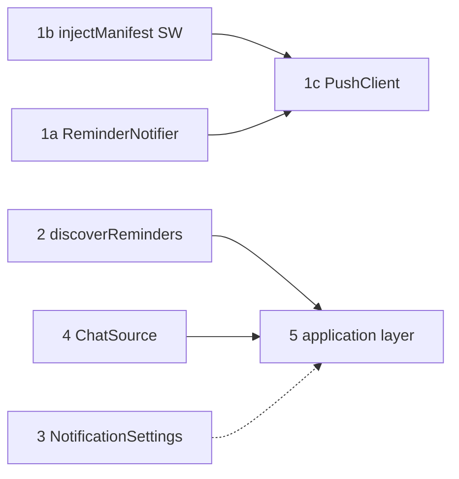

# Architecture deepening — implementation plan (for approval)

**Date:** 2026-08-22  
**Source:** Architecture review (`/tmp/architecture-review-20260822-175754.html`) + six [architecture-deepening-explorer](.cursor/agents/architecture-deepening-explorer.md) design briefs.

**Goal:** Finish PWA push notifications, fix dashboard/chat stat drift, and deepen shallow modules without a big-bang rewrite.

---

## What we are implementing (and why)

| Priority | Work | Why now |
|----------|------|---------|
| **P0** | Web push client + service worker delivery | Server can send; PWA cannot receive. Blocks the install → notify story. |
| **P0** | Reminder notifier (channel adapters) | Shallow fan-out; web-push always fires; test routes bypass one module. Pairs with push client. |
| **P1** | Reminder discovery (`discoverReminders`) | Dashboard urgent count disagrees with scanner and chat badges. User-visible bug. |
| **P2** | Notification settings module | Stops key leakage on `GET /notifications`; typed UI. Small, low risk. |
| **P3** | ChatSource seam | Enables scanner tests without Puppeteer; localizes WA scrape fragility. Medium effort. |
| **P4** | Application layer + thin HTTP adapter | `api.ts` is a shallow grab bag. High payoff but large surface. Do route-by-route. |

**Deferred (not in this plan):** Full `CONTEXT.md` / ADR pass (do as terms stabilize). Multi-user push subscriptions. Background Sync queue. Renaming `wa/` (already done).

---

## Design review (reflect-style)

**Judgment**

1. **One composition root, not two.** Both ChatSource (#3) and application layer (#5) introduce `AppDeps`. Pick `createWhatsApp()` first in Phase 3; let application modules consume `deps.chatSource` instead of inventing a second wiring style.
2. **Discovery before application layer for inbox.** `createInbox` would re-encode chat enrichment unless `discoverReminders` exists first. Phase 2 before Phase 4 inbox routes.
3. **Notifier before over-abstracting push settings.** Web push delivery is subscription-based, not provider-config. Keep it out of NotificationSettings (#6).

**Tooling**

1. **`injectManifest` is a migration, not a toggle.** Needs `strategies: 'injectManifest'`, custom `web/src/service-worker.ts`, and `kit.serviceWorker.register: false` in `svelte.config.js`. Verify precache still works before subscribe UI.
2. **Shared types:** Put `NotificationSettings` and `PushPayload` in `shared/` or duplicate thin type files so the Svelte app does not import server modules.
3. **Tests:** Vitest fakes at module seams (`FakeChatSource`, fake notification channels, fake KV for settings). No Puppeteer in unit tests.

**Divergent / what not to do yet**

1. **Do not do application layer (#5) and ChatSource (#3) in the same sprint.** Both touch `api.ts` and `index.ts` wiring. Sequence ChatSource first (smaller, enables tests).
2. **Do not merge push client and notifier in one PR.** Different seams (browser vs server). Land notifier first or in parallel with SW foundation; wire UI last.
3. **Do not delete `chatAnalysis` until discovery tests pass parity.** Migration step 1 adds module with zero caller switch.

---

## Phased rollout

### Phase 1 — Notifications end-to-end (P0)

**Outcome:** Installed PWA can subscribe; test push shows an OS notification; reminders fan out through one notifier module.

#### 1a. Reminder notifier (server)

- Add `src/notifications/types.ts`, `reminderContent.ts`, `dispatcher.ts`, `channels/{ntfy,gotify,webPush}Channel.ts`
- Replace `index.ts` with `initNotifications`, `sendReminder`, `sendTest`
- Delete `ntfy.ts`, `gotify.ts`, `web-push.ts` after channel move
- Update `runner.ts`, `api.ts` (`/push/test`, `/test-notification`), `index.ts` init
- Add `tests/notifications/dispatcher.test.ts`

**Interface (test surface):**

```typescript
initNotifications(): void;
sendReminder(chat: ForgottenChat): Promise<void>;
sendTest(title: string, body: string): Promise<DeliveryReport>;
```

#### 1b. Service worker foundation (web)

- Switch vite-pwa to `injectManifest`
- Add `web/src/service-worker.ts` with Workbox precache + `push` + `notificationclick`
- Set `kit.serviceWorker.register: false` in `svelte.config.js`
- **Checkpoint:** PWA still installs; precache works; no subscribe UI yet

#### 1c. Push client module (web + small server)

- `GET /api/push/config` → `{ publicKey }` (from `VAPID_PUBLIC_KEY`)
- Add `web/src/lib/push/` (or `push.ts`): `subscribe`, `unsubscribe`, `getStatus`, iOS standalone gate
- Update `settings/notifications/+page.svelte`: Enable / Disable / Test Web Push
- Shared payload contract: `{ title, body, url?, icon?, tag? }`

**Interface (test surface):**

```typescript
export type PushStatus = 'unsupported' | 'denied' | 'not-subscribed' | 'subscribed';
export function getPushStatus(): Promise<PushStatus>;
export function subscribeToPush(): Promise<void>;
export function unsubscribeFromPush(): Promise<void>;
```

**Effort:** M · **Risk:** medium (injectManifest + permission UX)

---

### Phase 2 — Stat consistency (P1)

**Outcome:** Dashboard urgent, chat list badges, and scanner agree on “need reply”.

- Add `src/domain/reminderDiscovery.ts` with `discoverReminders` + `reconcileStaleDone`
- Port tests from `chatAnalysis.test.ts` → `reminderDiscovery.test.ts`
- Switch `scanner.ts`, then `/chats`, then `/dashboard` in `api.ts`
- Optional: `src/engine/discoveryContext.ts` to dedupe API fetch + workflow map
- Delete `chatAnalysis.ts` when parity proven

**Behaviour change (intentional):** Dashboard urgent drops ignored/done chats. Chat list stops showing `!` on done rows.

**Effort:** M · **Risk:** medium (visible number changes)

---

### Phase 3 — Typed notification settings (P2)

**Outcome:** Notifications settings page uses booleans/numbers; API returns only `{ ntfy, gotify }`.

- Add `src/notifications/settings.ts` + `shared/notification-settings.ts`
- Migrate senders to `getNotificationSettings()`
- Update `GET/PUT /notifications` and Svelte page
- Remove notification keys from `SettingsMap` in `types.ts`
- Delete `config.ts`

**Effort:** M · **Risk:** low

---

### Phase 4 — ChatSource seam (P3)

**Outcome:** Scanner testable with `FakeChatSource`; scrape script isolated.

Incremental migration (from explorer):

1. Extract `scrape/recentChats.ts` (no call-site change)
2. Extract `WhatsAppSession` class
3. Add `ports/chatSource.ts` + `FakeChatSource`; `scanner.scan(chatSource)`
4. `createWhatsApp()` → `{ chatSource, whatsapp }` as `AppDeps`
5. Wire `index.ts`, `api.ts`, `runner.ts`; delete `client.ts` shim

**Effort:** M · **Risk:** medium (production WhatsApp path)

---

### Phase 5 — Application layer (P4)

**Outcome:** `api.ts` ~80 lines; use cases in `src/application/*`.

Route groups in order: settings → inbox → monitoring → operations/push.

- Add `AppDeps` + `createAppServices(deps)` (reuse Phase 4 `AppDeps` for whatsapp)
- Inbox routes use `discoverReminders` via `createInbox` (depends on Phase 2)

**Effort:** L · **Risk:** medium (20 routes, JSON shape regression)

---

## Dependency graph



---

## Files touched (summary)

| Phase | Add | Change | Delete |
|-------|-----|--------|--------|
| 1a | `notifications/channels/*`, `dispatcher.ts`, tests | `index.ts`, `runner.ts`, `api.ts` | `ntfy.ts`, `gotify.ts`, `web-push.ts` |
| 1b | `web/src/service-worker.ts` | `vite.config.ts`, `svelte.config.js` | — |
| 1c | `web/src/lib/push/*`, `GET /push/config` | notifications page | — |
| 2 | `domain/reminderDiscovery.ts`, tests | `scanner.ts`, `api.ts` | `chatAnalysis.ts` |
| 3 | `notifications/settings.ts`, `shared/*` | api, page, senders | `config.ts` |
| 4 | `ports/*`, `whatsapp/session.ts`, `create.ts`, fakes | `index.ts`, `api.ts`, `scanner.ts` | `client.ts` |
| 5 | `src/application/*`, tests | `api.ts` slim | — |

---

## Success criteria

- [ ] Subscribe on Android PWA → test push shows notification → tap opens app
- [ ] iOS 16.4+ standalone: subscribe gated; manual install flow documented in UI
- [ ] Reminder scan sends via notifier; disabled channels skipped
- [ ] Dashboard urgent === count of chats with `needsReply` on `/chats`
- [ ] `npm test` covers dispatcher + reminderDiscovery + notification settings
- [ ] Docker build passes; `VAPID_*` documented in README

---

## Approval

Reply with:

- **Approve** — proceed Phase 1 as written
- **Approve with changes** — list phase order or scope cuts
- **Defer** — which phases to skip (e.g. “1 only”, “skip Phase 5”)

No code lands until you approve.
