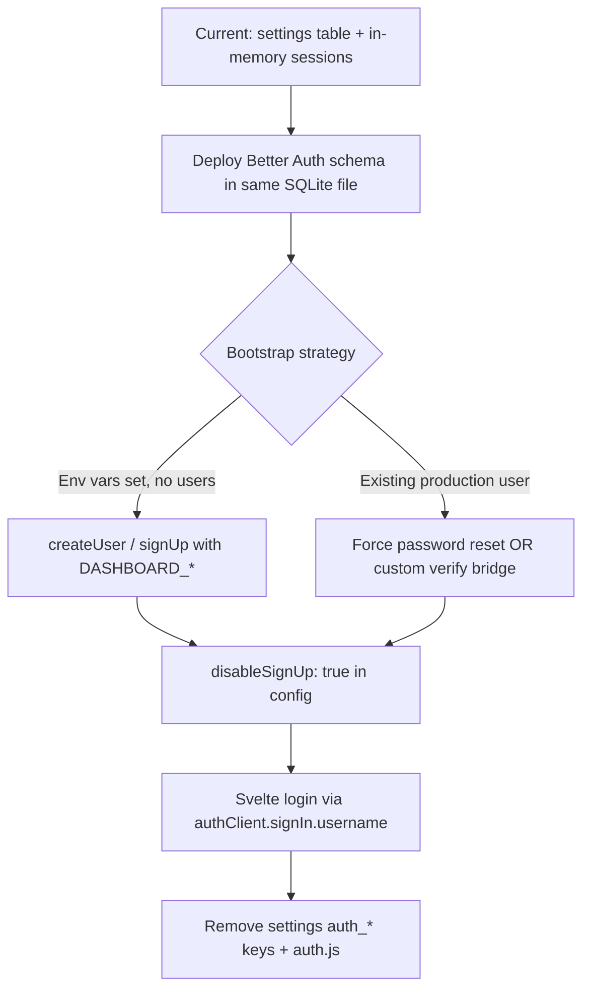

# Better Auth integration for Respondr — Research findings

**Date:** 2026-08-18  
**Scope:** Evaluate [Better Auth](https://better-auth.com) for the planned SvelteKit + Hono monolith rebuild, replacing custom `src/server/auth.js`, and document integration, migration, and risks.

---

## Executive summary

Better Auth is a **TypeScript-first** authentication framework with built-in **email/password**, **cookie-based server-side sessions** (stored in the database by default), a **plugin system**, and first-class integrations for **Hono** and **SvelteKit**. It fits Respondr’s rebuild well: same-origin Hono monolith, SQLite via `better-sqlite3`, and a move from CommonJS to TypeScript/ESM.

### Recommended architecture for Respondr

```
┌─────────────────────────────────────────────────────────────┐
│  Hono (Node 22) — single origin, one process                │
│                                                             │
│  /api/auth/*     → auth.handler(c.req.raw)   [Better Auth] │
│  /api/*          → WhatsApp / status / chats APIs           │
│  /*              → SvelteKit static SPA (adapter-static)    │
│                                                             │
│  SQLite (respondr.db)                                       │
│    ├── existing tables (settings, chats, history, …)        │
│    └── Better Auth tables (user, session, account, …)       │
└─────────────────────────────────────────────────────────────┘

SvelteKit (build-time only for static adapter)
  └── createAuthClient from "better-auth/svelte" → calls /api/auth/*
```

| Layer | Choice | Rationale |
|-------|--------|-----------|
| Auth mount point | **Hono** (`app.all("/api/auth/*", …)`) | Monolith serves API + static SPA; no SvelteKit server at runtime |
| Database adapter | **Direct `better-sqlite3`** (phase 1) | Official recommended path; share existing `Database` singleton; `auth migrate` applies schema |
| ORM (phase 2) | **Drizzle** optional | TS synergy for new code; generate auth schema via CLI; migrate app tables gradually |
| Login UX | **Username plugin** + synthetic local email | Preserves username/password flow; email required internally by Better Auth |
| Single-user | **`disableSignUp: true`** + bootstrap script / env hook | Matches self-hosted dashboard model |
| Session persistence | **DB-backed sessions** | Fixes in-memory session loss on restart |

---

## Decision: mount auth on Hono vs SvelteKit hooks

**Decision: mount on Hono.**

| Approach | Works with static SvelteKit monolith? | Notes |
|----------|--------------------------------------|-------|
| **Hono `auth.handler(c.req.raw)`** | Yes | [Hono integration](https://better-auth.com/docs/integrations/hono): Web Standard `Request`/`Response`; register **before** catch-all SPA route |
| **SvelteKit `svelteKitHandler` in `hooks.server.ts`** | No (static adapter) | Requires a running SvelteKit server; [SvelteKit integration](https://better-auth.com/docs/integrations/svelte-kit) is for SSR/Node adapter deployments |
| **`sveltekitCookies` plugin** | Not needed in monolith | Only for server actions / `signInEmail` from SvelteKit server code |
| **`createAuthClient` (client)** | Yes | [Installation — client](https://better-auth.com/docs/installation#create-client-instance): same-origin → omit `baseURL`; uses `credentials: "include"` by default |

The [Hono Cloudflare example](https://hono.dev/examples/better-auth-on-cloudflare) uses Drizzle + Postgres, but the **mount pattern is identical on Node.js** — only the database wiring differs. Better Auth’s own [installation Hono tab](https://better-auth.com/docs/installation) shows:

```ts
app.on(["POST", "GET"], "/api/auth/*", (c) => auth.handler(c.req.raw));
```

For Node monoliths, prefer `app.all("/api/auth/*", …)` so all methods are forwarded ([Hono integration — mount handler](https://better-auth.com/docs/integrations/hono#mount-the-auth-handler)).

---

## Research answers

### 1. What is Better Auth?

| Aspect | Detail | Source |
|--------|--------|--------|
| **Session model** | Cookie-based; opaque `session_token` cookie; session row in DB (`id`, `token`, `userId`, `expiresAt`, `ipAddress`, `userAgent`) | [Session management](https://better-auth.com/docs/concepts/session-management) |
| **Default TTL** | 7 days (`expiresIn`); sliding refresh via `updateAge` (default 1 day) | [Session expiration](https://better-auth.com/docs/concepts/session-management#session-expiration) |
| **Email/password** | Opt-in via `emailAndPassword.enabled: true`; passwords in `account` table (`providerId: credential`); **scrypt** (Node built-in) | [Email & password](https://better-auth.com/docs/authentication/email-password), [options](https://better-auth.com/docs/reference/options#emailandpassword) |
| **Plugins** | Admin, username, 2FA, organizations, etc. | [Plugins](https://better-auth.com/docs/plugins/admin), [username](https://better-auth.com/docs/plugins/username) |
| **TypeScript** | TS-first; `auth.$Infer.Session`, client `$Infer`, `inferAdditionalFields` plugin | [TypeScript](https://better-auth.com/docs/concepts/typescript) |

### 2. SQLite + better-sqlite3

| Question | Answer |
|----------|--------|
| Official adapter? | **Yes — recommended** for Node.js: `database: new Database("database.sqlite")` | [SQLite adapter](https://better-auth.com/docs/adapters/sqlite#better-sqlite3-recommended) |
| Drizzle vs Kysely vs direct? | **Direct `better-sqlite3`** uses Kysely internally. Drizzle is optional via `@better-auth/drizzle-adapter`. Kysely is not a separate integration path for app code — it’s the built-in layer. | [SQLite](https://better-auth.com/docs/adapters/sqlite), [Drizzle adapter](https://better-auth.com/docs/adapters/drizzle) |
| Share DB with existing tables? | **Yes.** Pass the **same** `better-sqlite3` instance Respondr already uses (`getDb()`). Auth tables (`user`, `session`, `account`, `verification`) coexist with `settings`, `history`, etc. Remove `auth_username` / `auth_password_hash` from `settings` after migration. | [Installation — SQLite](https://better-auth.com/docs/installation#configure-database) |
| Schema setup | **Kysely path:** `npx auth@latest migrate` (creates tables in-place). **Drizzle path:** `npx auth@latest generate` → `drizzle-kit generate` → `drizzle-kit migrate` | [CLI](https://better-auth.com/docs/concepts/cli), [Database](https://better-auth.com/docs/concepts/database#running-migrations) |

**Recommendation:** Start with direct `better-sqlite3` + `auth migrate` (fewest moving parts). Introduce Drizzle when converting DB modules to TypeScript, not because Better Auth requires it.

### 3. Hono integration (Node.js)

Pattern from official docs (not Cloudflare-specific):

```ts
import { Hono } from "hono";
import { auth } from "./auth";

const app = new Hono();

// Register BEFORE catch-all static/SPA routes
app.all("/api/auth/*", (c) => auth.handler(c.req.raw));

// Session for protected API routes
app.use("/api/*", sessionMiddleware); // auth.api.getSession({ headers: c.req.raw.headers })
```

- No adapter library needed — Hono and Better Auth both use Web Standard APIs ([Hono integration](https://better-auth.com/docs/integrations/hono)).
- **CORS not required** for same-origin monolith ([Hono integration — CORS](https://better-auth.com/docs/integrations/hono#cors) only applies cross-origin).
- Cloudflare-only concern: `nodejs_compat` for AsyncLocalStorage — **not applicable** to Node 22 ([installation — Cloudflare](https://better-auth.com/docs/installation)).

### 4. SvelteKit integration (static SPA + Hono API)

| Component | Role in Respondr monolith |
|-----------|---------------------------|
| `svelteKitHandler` | **Skip** — no SvelteKit server in production |
| `sveltekitCookies` | **Skip** — no server actions setting auth cookies |
| `createAuthClient` from `better-auth/svelte` | **Use** — reactive `useSession()`, `signIn`, `signOut` in Svelte components |
| Static adapter | **Fully compatible** — client calls `/api/auth/*` on same origin; cookies set by Hono response |

Client setup ([SvelteKit integration — create a client](https://better-auth.com/docs/integrations/svelte-kit#create-a-client)):

```ts
// src/lib/auth-client.ts
import { createAuthClient } from "better-auth/svelte";
import { usernameClient } from "better-auth/client/plugins";

export const authClient = createAuthClient({
  plugins: [usernameClient()],
});
```

Optional SSR hydration (`hydrateSession`) only matters if you later add SSR — not for static adapter ([Client — SSR hydration](https://better-auth.com/docs/concepts/client#ssr-hydration)).

### 5. Monolith routing layout

Suggested Hono route order:

1. **Public assets** — `/manifest.json`, `/sw.js`, icons, built SvelteKit assets (`/_app/*`, etc.)
2. **Better Auth** — `/api/auth/*` (must not be swallowed by SPA fallback)
3. **Protected API middleware** — `auth.api.getSession` for `/api/*` (exclude `/api/auth`)
4. **App API** — `/api/whatsapp`, `/api/status`, …
5. **SPA fallback** — `GET /*` → `index.html` for client-side routing (`/login`, `/setup`, `/chats`, …)

Same origin means:
- No `trustedOrigins` / CORS config needed beyond defaults
- Cookies work in PWA standalone mode ([Cookies — Safari](https://better-auth.com/docs/concepts/cookies#safari-itp-and-cross-domain-setups) issues only arise cross-domain)

Set explicitly in production:

```env
BETTER_AUTH_URL=https://your-host:9595
BETTER_AUTH_SECRET=<openssl rand -base64 32>
```

([Installation — env vars](https://better-auth.com/docs/installation#set-environment-variables), [options — baseURL](https://better-auth.com/docs/reference/options#baseurl))

### 6. Single-user / self-hosted

| Mechanism | Use for Respondr |
|-----------|------------------|
| `emailAndPassword.disableSignUp: true` | Block public registration after bootstrap ([options](https://better-auth.com/docs/reference/options#emailandpassword)) |
| `disabledPaths: ["/sign-up/email"]` | Extra hardening ([options — disabledPaths](https://better-auth.com/docs/reference/options#disabledpaths)) |
| `databaseHooks.user.create.before` | Reject create when `user` count ≥ 1 |
| **Admin plugin** + `npx auth@latest create-admin` | Create first admin; `admin.createUser` for future multi-user ([Admin plugin](https://better-auth.com/docs/plugins/admin)) |
| Env bootstrap (`DASHBOARD_USER` / `DASHBOARD_PASSWORD`) | On startup, if zero users: call `auth.api.signUpEmail` or admin `createUser` once, then rely on `disableSignUp` |

**Bootstrap pattern (preserves current `.env.example` semantics):**

```ts
async function ensureBootstrapUser() {
  const users = await db.prepare("SELECT COUNT(*) as c FROM user").get();
  if (users.c > 0) return;
  const email = process.env.DASHBOARD_USER;
  const password = process.env.DASHBOARD_PASSWORD;
  if (!email || !password) return;
  await auth.api.signUpEmail({
    body: {
      email: `${email}@local.respondr`,
      name: email,
      password,
      username: email, // requires username plugin
    },
  });
}
```

For strict single-user, combine `disableSignUp: true` with bootstrap via **admin `createUser`** or a one-time migration script (signup endpoint disabled in production).

### 7. Migration from custom `auth.js`

| Topic | Current (`auth.js`) | Better Auth | Migration |
|-------|---------------------|-------------|-----------|
| Session storage | In-memory `Map` | SQLite `session` table | **Automatic win** — sessions survive restart |
| Session cookie | `session` (custom token) | `better-auth.session_token` (default prefix) | **All users re-login once** |
| Password hash | Custom scrypt `salt:hex` in `settings` | scrypt in `account.password` (different format) | **Not byte-compatible** — see below |
| Username login | Plain username in settings | Email required; use **username plugin** for `signIn.username` | Map username → synthetic email or username field |
| Setup flow | `/setup` EJS + `configureAccount` | Client `signUp` or bootstrap | Replace with Svelte `/setup` calling `authClient` |
| Env bootstrap | `ensureAccountFromEnv()` | Startup bootstrap calling Better Auth API | Equivalent |
| API protection | `authMiddleware` sets `c.set('user')` | `auth.api.getSession({ headers })` in Hono middleware | Replace middleware |
| Min password length | 6 chars | Default **8** chars ([options](https://better-auth.com/docs/reference/options#emailandpassword)) | Document breaking change or set `minPasswordLength: 6` |

**Password hash migration options:**

1. **Force re-setup (simplest):** Clear auth settings; users set password via bootstrap env or setup UI. Recommended for self-hosted single-user.
2. **Custom `password.verify` (transitional):** Implement verifier that checks legacy `salt:hash` from `settings`, then re-hash with Better Auth’s hasher on successful login and write to `account` table. Better Auth supports custom hash/verify ([Email & password — password hashing](https://better-auth.com/docs/authentication/email-password#configuration)).
3. **Do not migrate hashes:** Formats differ even though both use scrypt — Respondr uses per-password random salt in settings; Better Auth manages its own `account.password` encoding.

### 8. Packages and setup

#### Minimal (phase 1 — recommended start)

```json
{
  "dependencies": {
    "better-auth": "^1.x",
    "better-sqlite3": "^12.x",
    "hono": "^4.x",
    "@hono/node-server": "^2.x"
  },
  "devDependencies": {
    "typescript": "^5.x",
    "@types/better-sqlite3": "^7.x"
  }
}
```

CLI (dev/ops): `npx auth@latest migrate` or `npx auth@latest generate`

#### With Drizzle (phase 2 — TS migration)

```json
{
  "dependencies": {
    "better-auth": "^1.x",
    "@better-auth/drizzle-adapter": "^1.x",
    "drizzle-orm": "^0.x",
    "better-sqlite3": "^12.x"
  },
  "devDependencies": {
    "drizzle-kit": "^0.x",
    "typescript": "^5.x",
    "@types/better-sqlite3": "^7.x"
  }
}
```

#### Environment variables

| Variable | Purpose |
|----------|---------|
| `BETTER_AUTH_SECRET` | Signing/encryption (≥32 chars); required in production ([options — secret](https://better-auth.com/docs/reference/options#secret)) |
| `BETTER_AUTH_URL` | Public app URL ([installation](https://better-auth.com/docs/installation#set-environment-variables)) |
| `BETTER_AUTH_SECRETS` | Optional rotation ([options — secrets](https://better-auth.com/docs/reference/options#secrets)) |
| `DASHBOARD_USER` / `DASHBOARD_PASSWORD` | Keep for first-run bootstrap (Respondr-specific) |

Generate secret: `npx auth@latest secret` or `openssl rand -base64 32` ([CLI — secret](https://better-auth.com/docs/concepts/cli#secret)).

#### Drizzle schema workflow

1. `better-auth.config.ts` exporting `auth` instance with `drizzleAdapter`
2. `npx auth@latest generate --config ./better-auth.config.ts --output ./src/db/auth-schema.ts`
3. `npx drizzle-kit generate` → `npx drizzle-kit migrate`

([Drizzle adapter](https://better-auth.com/docs/adapters/drizzle#schema-generation--migration), [Hono example](https://hono.dev/examples/better-auth-on-cloudflare))

### 9. TypeScript migration synergy

| Feature | Benefit for Respondr |
|---------|---------------------|
| `typeof auth.$Infer.Session` | Typed session/user in Hono middleware |
| `createAuthClient` + `inferAdditionalFields<typeof auth>()` | Typed client in Svelte (monorepo) |
| CLI `auth generate` | Drizzle schema for auth tables — reduces hand-written SQL |
| Strict TS | Better Auth expects `strict` or `strictNullChecks` ([TypeScript config](https://better-auth.com/docs/concepts/typescript#strict-mode)) |
| ESM | Better Auth targets ESM; [installation notes CommonJS unsupported for Node handlers](https://better-auth.com/docs/installation) — aligns with rebuild TS/ESM goal |

**Suggested TS conversion order (auth-related):**

1. `src/db/index.ts` — export shared `Database` singleton  
2. `src/server/auth.ts` — `betterAuth({ … })` config  
3. `src/server/session-middleware.ts` — Hono middleware  
4. `src/server/index.ts` — mount routes  
5. Svelte `src/lib/auth-client.ts` + login/setup pages  
6. Remaining 23 JS backend files — app tables can stay on raw SQL until Drizzle adoption

### 10. Gotchas

| Issue | Detail | Mitigation |
|-------|--------|------------|
| **Session lost on restart** | Current in-memory sessions cleared on deploy | Better Auth DB sessions fix this ([session table](https://better-auth.com/docs/concepts/session-management#session-table)) |
| **Mobile 30-day TTL** | Respondr uses 30d cookie for mobile UA | Set `session.expiresIn: 60 * 60 * 24 * 30`; `rememberMe` on sign-in affects browser-close behavior ([sign in](https://better-auth.com/docs/authentication/email-password#sign-in)) |
| **PWA cookies** | Same-origin monolith: cookies work in standalone PWA | Avoid cross-domain API; see [Cookies](https://better-auth.com/docs/concepts/cookies) |
| **Cookie name change** | `session` → `better-auth.session_token` | One-time re-login; optional `advanced.cookiePrefix` / custom cookie names |
| **Password min length** | 8 default vs Respondr 6 | Set `minPasswordLength: 6` or enforce 8 in UI |
| **Email required** | Better Auth is email-centric | Username plugin + synthetic `@local.respondr` email |
| **`cookieCache`** | Optional perf; delayed revocation on other devices | Leave disabled for single-user; see [session caching](https://better-auth.com/docs/concepts/session-management#session-caching) |
| **Rate limiting** | Enabled in production by default | Fine for self-hosted; tune via `rateLimit` if needed ([options](https://better-auth.com/docs/reference/options#ratelimit)) |
| **CommonJS** | ESM expected | Plan `"type": "module"` + TS compile for rebuild |
| **Route ordering** | SPA catch-all can block `/api/auth` | Register auth route first ([Hono integration](https://better-auth.com/docs/integrations/hono#mount-the-auth-handler)) |

---

## Step-by-step integration plan

### Phase 0 — Prerequisites

- [ ] Convert project to **TypeScript + ESM** (`"type": "module"`, `tsconfig.json` with `strict: true`)
- [ ] Add `BETTER_AUTH_SECRET` and `BETTER_AUTH_URL` to `.env.example`
- [ ] Keep `DATA_DIR` / `DB_PATH` paths; auth shares `respondr.db`

### Phase 1 — Server auth (Hono)

1. `npm install better-auth`
2. Create `src/server/auth.ts`:

```ts
import { betterAuth } from "better-auth";
import { username } from "better-auth/plugins";
import Database from "better-sqlite3";
import { getDb } from "../db/index.js";

export const auth = betterAuth({
  appName: "Respondr",
  baseURL: process.env.BETTER_AUTH_URL,
  secret: process.env.BETTER_AUTH_SECRET,
  database: getDb() as unknown as Database.Database, // shared singleton
  emailAndPassword: {
    enabled: true,
    disableSignUp: true,
    minPasswordLength: 6,
  },
  session: {
    expiresIn: 60 * 60 * 24 * 7,       // desktop default
    // consider 30d for mobile-heavy usage
  },
  plugins: [username()],
});
```

3. Run `npx auth@latest migrate` against the auth config
4. Mount in Hono **before** SPA fallback and **before** generic `/api` auth middleware
5. Replace `authMiddleware` with `sessionMiddleware` using `auth.api.getSession`
6. Implement `ensureBootstrapUser()` for `DASHBOARD_*` env vars (first run only)

### Phase 2 — SvelteKit client

1. `createAuthClient` in `src/lib/auth-client.ts` with `usernameClient()`
2. Login page: `authClient.signIn.username({ username, password, rememberMe })`
3. Setup page (first run only): temporarily allow signup OR use server bootstrap only
4. Route guards in SvelteKit `+layout.ts` / `+page.ts` using `authClient.useSession()` or `getSession()`
5. Build with `adapter-static`; output to `build/` served by Hono

### Phase 3 — Cleanup

- [ ] Remove `src/server/auth.js`, EJS login/setup views, settings keys `auth_username` / `auth_password_hash`
- [ ] Update API routes to read `session.user` instead of `c.get('user')`
- [ ] Document one-time re-login after deploy

### Phase 4 — Optional hardening

- [ ] Admin plugin if multi-user is needed later
- [ ] Drizzle for app tables + generated auth schema
- [ ] `advanced.database.joins: true` if using Drizzle adapter ([performance](https://better-auth.com/docs/adapters/sqlite#joins))

---

## Migration path from `auth.js`



**Per-request auth replacement:**

| Before | After |
|--------|-------|
| `getUserFromCookie(c)` | `(await auth.api.getSession({ headers: c.req.raw.headers }))?.user` |
| `c.set('user', username)` | `c.set('session', session)` / `c.set('user', session.user)` |
| `401` on `/api/*` | Same, keyed off missing session |
| Redirect to `/login` | Svelte client-side redirect (SPA) or Hono redirect for non-API |

---

## TypeScript / Drizzle `package.json` additions (rebuild target)

```json
{
  "type": "module",
  "scripts": {
    "build": "vite build",
    "build:server": "tsc -p tsconfig.server.json",
    "auth:migrate": "auth migrate",
    "auth:generate": "auth generate",
    "db:generate": "drizzle-kit generate",
    "db:migrate": "drizzle-kit migrate"
  },
  "dependencies": {
    "better-auth": "^1.0.0",
    "@better-auth/drizzle-adapter": "^1.0.0",
    "better-sqlite3": "^12.11.1",
    "drizzle-orm": "^0.44.0",
    "hono": "^4.12.30",
    "@hono/node-server": "^2.0.11"
  },
  "devDependencies": {
    "drizzle-kit": "^0.31.0",
    "typescript": "^5.8.0",
    "@types/better-sqlite3": "^7.6.0"
  }
}
```

Pin versions at implementation time. Phase 1 can omit Drizzle packages entirely.

---

## Risk register

| ID | Risk | Likelihood | Impact | Mitigation |
|----|------|------------|--------|------------|
| R1 | ESM migration breaks CommonJS `require()` across 23 backend files | High | Medium | Incremental TS compile; dual-run period; start with auth + server entry |
| R2 | Password hashes incompatible → locked out after upgrade | Medium | High | Env bootstrap for single-user; document reset; optional custom `password.verify` bridge |
| R3 | Cookie rename forces re-login | Certain | Low | Communicate in changelog; acceptable for self-hosted |
| R4 | `minPasswordLength` 8 vs 6 breaks existing passwords on re-setup | Low | Medium | Set `minPasswordLength: 6` or require new password at migration |
| R5 | SPA catch-all intercepts `/api/auth/*` | Medium | High | Strict route registration order; integration test for auth endpoints |
| R6 | Username-only UX vs email requirement | Medium | Low | Username plugin + synthetic email |
| R7 | Premature Drizzle adoption slows rebuild | Medium | Medium | Defer Drizzle; use `auth migrate` on direct SQLite first |
| R8 | Multi-user scope creep | Low | Low | `disableSignUp` + admin plugin later; hooks to cap user count |
| R9 | iOS PWA auth cookies (ITP) | Low | Medium | Same-origin monolith avoids cross-domain cookie blocking ([Cookies](https://better-auth.com/docs/concepts/cookies#safari-itp-and-cross-domain-setups)) |
| R10 | Better Auth API / schema changes on upgrade | Medium | Medium | Pin version; run `auth migrate` after plugin changes; follow [1.7 upgrade guide](https://better-auth.com/docs/guides/1-7-upgrade-guide) |

---

## Primary source URL index

### Better Auth (better-auth.com)

| Topic | URL |
|-------|-----|
| Installation | https://better-auth.com/docs/installation |
| Hono integration | https://better-auth.com/docs/integrations/hono |
| SvelteKit integration | https://better-auth.com/docs/integrations/svelte-kit |
| SQLite adapter | https://better-auth.com/docs/adapters/sqlite |
| Drizzle adapter | https://better-auth.com/docs/adapters/drizzle |
| Session management | https://better-auth.com/docs/concepts/session-management |
| Cookies | https://better-auth.com/docs/concepts/cookies |
| Database / schema | https://better-auth.com/docs/concepts/database |
| CLI | https://better-auth.com/docs/concepts/cli |
| TypeScript | https://better-auth.com/docs/concepts/typescript |
| Email & password | https://better-auth.com/docs/authentication/email-password |
| Options reference | https://better-auth.com/docs/reference/options |
| Hooks | https://better-auth.com/docs/concepts/hooks |
| Admin plugin | https://better-auth.com/docs/plugins/admin |
| Username plugin | https://better-auth.com/docs/plugins/username |
| SvelteKit example | https://better-auth.com/docs/examples/svelte-kit |
| 1.7 upgrade guide | https://better-auth.com/docs/guides/1-7-upgrade-guide |

### Hono

| Topic | URL |
|-------|-----|
| Better Auth on Cloudflare (mount pattern) | https://hono.dev/examples/better-auth-on-cloudflare |
| Hono middleware guide | https://hono.dev/docs/guides/middleware |

### Better Auth GitHub

| Topic | URL |
|-------|-----|
| Init options (types source) | https://github.com/better-auth/better-auth/blob/main/packages/core/src/types/init-options.ts |
| ID generation utils | https://github.com/better-auth/better-auth/blob/main/packages/core/src/utils/id.ts |

### Respondr (current implementation — migration baseline)

| File | Relevance |
|------|-----------|
| `src/server/auth.js` | Custom scrypt, in-memory sessions, `DASHBOARD_*` bootstrap |
| `src/server/index.js` | Hono middleware order, static assets |
| `src/db/index.js` | Shared SQLite singleton |
| `.env.example` | `DASHBOARD_USER`, `DASHBOARD_PASSWORD` |
