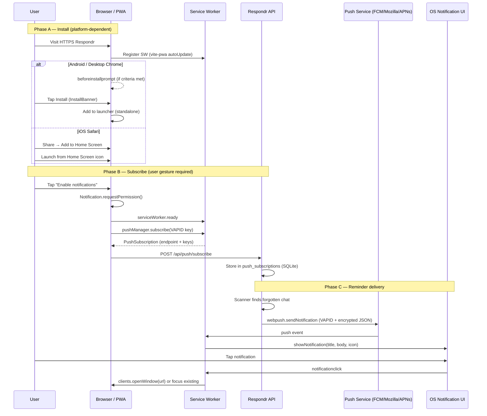

# PWA install and Web Push notifications for Respondr — Research findings

## Question

How should Respondr deliver notifications to users who install the PWA? What is the end-to-end flow from install → service worker → push subscription → server send → OS notification?

## Short answer

Respondr should treat **PWA install and Web Push as related but separable steps**:

1. **Install** improves launch UX and is **required for push on iOS** (Home Screen web app, iOS/iPadOS 16.4+), but **not required on Android Chrome or desktop** where push works from a normal HTTPS tab once a service worker is registered.
2. **Push** requires an active service worker, a **user-gesture permission request**, a `PushManager.subscribe()` call with the VAPID public key, and a service worker `push` handler that calls `showNotification()` — browsers enforce visible notifications for push (`userVisibleOnly: true`).
3. Respondr already has the **server half** (VAPID via `web-push`, SQLite subscription storage, `/api/push/*` endpoints, reminder fan-out). The **client half is missing**: no subscribe UI, no VAPID public key exposure, no custom service worker with `push` / `notificationclick` handlers (the current `@vite-pwa/sveltekit` `generateSW` Workbox worker only precaches assets).

**Recommended funnel:** install banner (Android/desktop) or iOS Add-to-Home-Screen helper → user opens installed app → explicit “Enable notifications” button in Settings → subscribe + POST to server → test push confirms the loop.

## Primary-source findings

### 1. PWA install requirements

Browsers decide installability from the **web app manifest**, **HTTPS**, and **engagement heuristics** ([web.dev — What does it take to be installable?](https://web.dev/articles/install-criteria)).

**Chrome install criteria** (fires `beforeinstallprompt` when met):

| Requirement | Detail |
|---|---|
| HTTPS | Secure context required |
| Manifest | `short_name` or `name`; `start_url`; `display` ∈ `fullscreen`, `standalone`, `minimal-ui`, `window-controls-overlay`; icons with **192px and 512px**; `prefer_related_applications` absent or `false` |
| Not already installed | Duplicate install blocked |
| Engagement | At least **one click/tap** on the page (any prior visit counts) and **≥ 30 seconds** total viewing time (any prior visit counts) |
| Service worker | Implied by PWA stack; Respondr registers one via `@vite-pwa/sveltekit` |

**`beforeinstallprompt`** fires when criteria are met; apps typically call `event.preventDefault()`, stash the `BeforeInstallPromptEvent`, and later call `prompt()` from a user click ([MDN — `beforeinstallprompt`](https://developer.mozilla.org/en-US/docs/Web/API/Window/beforeinstallprompt_event), [web.dev — How to provide your own in-app install experience](https://web.dev/articles/customize-install)).

**iOS / iPadOS:** no `beforeinstallprompt`. Users install via Share → Add to Home Screen. A manifest with `display: standalone` or `fullscreen` makes the icon open as a Home Screen web app ([WebKit — Web Push for Web Apps on iOS and iPadOS](https://webkit.org/blog/13878/web-push-for-web-apps-on-ios-and-ipados/)).

**Respondr today:** `web/vite.config.ts` defines a compliant manifest (`standalone`, icons 192/512, `start_url: '/'`). `InstallBanner.svelte` handles `beforeinstallprompt` + iOS manual hint. `registerType: 'autoUpdate'` keeps the Workbox-generated SW updated.

### 2. Does push require install?

| Platform | Install required for Web Push? | Notes |
|---|---|---|
| **Android Chrome** (browser tab) | **No** | Push needs HTTPS + active service worker + permission ([MDN — Push API](https://developer.mozilla.org/en-US/docs/Web/API/Push_API)) |
| **Android Chrome** (installed PWA) | No (but recommended) | Installed app uses same origin/SW; OS launcher integration |
| **Desktop Chrome / Edge / Firefox** | **No** | Same as browser-tab push |
| **macOS Safari 16.1+** | **No** | Standards-based Web Push in Safari ([WebKit blog](https://webkit.org/blog/13878/web-push-for-web-apps-on-ios-and-ipados/) — same W3C stack as Ventura) |
| **iOS/iPadOS Safari tab** | **Yes — push unavailable** | Push APIs only in Home Screen web app ([WebKit blog](https://webkit.org/blog/13878/web-push-for-web-apps-on-ios-and-ipados/)) |
| **iOS/iPadOS Home Screen PWA** | **Yes** (must be added to Home Screen) | iOS/iPadOS **16.4+** |

**Implication:** Respondr’s install banner copy (“push notifications”) is accurate for iOS but overstated for Android/desktop, where push can work without install — though install still improves retention and matches user mental models ([web.dev — Patterns for promoting PWA installation](https://web.dev/articles/promote-install)).

### 3. Permission UX rules

**Notifications permission** must be requested in response to a **user gesture** (button click). Browsers increasingly block permission prompts not triggered by gestures ([MDN — Using the Notifications API](https://developer.mozilla.org/en-US/docs/Web/API/Notifications_API/Using_the_Notifications_API)).

**`PushManager.subscribe()`** should also run inside a gesture handler ([MDN — `PushManager.subscribe()`](https://developer.mozilla.org/en-US/docs/Web/API/PushManager/subscribe)).

**iOS Home Screen apps:** permission prompt only after direct user interaction (e.g. Subscribe button) inside the standalone PWA ([WebKit blog](https://webkit.org/blog/13878/web-push-for-web-apps-on-ios-and-ipados/)).

**Best practices** ([web.dev — promote install](https://web.dev/articles/promote-install)):

- Keep prompts out of critical flows; allow dismiss; remember dismissal.
- Do not request notification permission on first page load.
- On Android, only show install UI after `beforeinstallprompt` (except iOS manual path).

**`userVisibleOnly: true`** is required in Chrome/Edge; omitting it rejects the subscribe promise ([MDN — `PushManager.subscribe()`](https://developer.mozilla.org/en-US/docs/Web/API/PushManager/subscribe)). This means **no silent push** — every delivery must surface a notification ([web.dev — push events](https://web.dev/articles/push-notifications-handling-messages)).

### 4. Client subscription flow

End-to-end client steps (after service worker is registered):

```
User taps "Enable notifications"
  → Notification.requestPermission()  // yields "granted" | "denied" | "default"
  → navigator.serviceWorker.ready
  → registration.pushManager.subscribe({
        userVisibleOnly: true,
        applicationServerKey: <VAPID public key as Uint8Array>
     })
  → subscription.toJSON()  // { endpoint, keys: { p256dh, auth } }
  → POST /api/push/subscribe with JSON body
```

Key APIs ([MDN — Push API](https://developer.mozilla.org/en-US/docs/Web/API/Push_API), [MDN — `PushManager.subscribe()`](https://developer.mozilla.org/en-US/docs/Web/API/PushManager/subscribe)):

- App must have an **active service worker** before subscribing.
- `applicationServerKey` is the **VAPID ECDH P-256 public key** (not the encryption key for message bodies).
- Each subscription is unique per service worker; the **endpoint URL is a secret capability** — treat it like a token.
- Use `pushManager.getSubscription()` on app load to detect existing subscriptions ([MDN — `PushManager.getSubscription`](https://developer.mozilla.org/en-US/docs/Web/API/PushManager/getSubscription)).
- On logout or “disable”, call `subscription.unsubscribe()` and `POST /api/push/unsubscribe`.

**VAPID public key for the client:** must be served from the server (e.g. `GET /api/push/vapid-public-key` reading `VAPID_PUBLIC_KEY` from env). The key must be converted from URL-safe base64 to `Uint8Array` before passing to `subscribe()`.

**CSRF note:** MDN warns that push subscription endpoints must be protected against CSRF when implementing server-side subscribe handlers ([MDN — Push API](https://developer.mozilla.org/en-US/docs/Web/API/Push_API)). Respondr’s authenticated session cookies partially mitigate this.

### 5. Service worker `push` and `notificationclick` handlers

When the push service delivers a message, the browser starts (or wakes) the service worker and fires **`push`** ([MDN — `push` event](https://developer.mozilla.org/en-US/docs/Web/API/ServiceWorkerGlobalScope/push_event)).

**Critical Chrome behavior:** the push handler must call `registration.showNotification()` and pass the resulting promise into `event.waitUntil()`. If not, Chrome shows a generic “This site has been updated in the background.” notification ([web.dev — Push events](https://web.dev/articles/push-notifications-handling-messages)).

**Typical handler pattern:**

```js
self.addEventListener('push', (event) => {
  const data = event.data?.json() ?? {};
  const promise = self.registration.showNotification(data.title ?? 'Respondr', {
    body: data.body,
    icon: data.icon ?? '/icon-192.png',
    badge: '/icon-192.png',
    data: { url: data.url ?? '/' },
    tag: data.tag // optional dedup
  });
  event.waitUntil(promise);
});
```

**`notificationclick`** fires when the user activates a notification created via `showNotification()` ([MDN — `notificationclick`](https://developer.mozilla.org/en-US/docs/Web/API/ServiceWorkerGlobalScope/notificationclick_event)):

```js
self.addEventListener('notificationclick', (event) => {
  event.notification.close();
  const url = event.notification.data?.url ?? '/';
  event.waitUntil(
    clients.matchAll({ type: 'window', includeUncontrolled: true }).then((list) => {
      for (const client of list) {
        if (client.url.includes(url) && 'focus' in client) return client.focus();
      }
      if (clients.openWindow) return clients.openWindow(url);
    })
  );
});
```

**Respondr gap:** `@vite-pwa/sveltekit` with default `generateSW` strategy produces a Workbox precache worker only — **no push handlers**. To add them, switch to **`injectManifest`** with a custom `src/service-worker.ts` that calls `precacheAndRoute(self.__WB_MANIFEST)` plus push/notificationclick listeners ([vite-pwa docs — SvelteKit](https://github.com/vite-pwa/docs/blob/main/frameworks/sveltekit.md), [injectManifest guide](https://github.com/vite-pwa/docs/blob/main/guide/inject-manifest.md)). Set `kit.serviceWorker.register: false` in `svelte.config.js` so SvelteKit does not double-register ([vite-pwa SvelteKit docs](https://github.com/vite-pwa/docs/blob/main/frameworks/sveltekit.md)).

### 6. Server payload format (`web-push` npm + VAPID)

**VAPID setup** ([web-push README](https://github.com/web-push-libs/web-push/blob/master/README.md), [RFC 8292](https://datatracker.ietf.org/doc/html/rfc8292)):

```js
webpush.setVapidDetails(
  'mailto:respondr@example.com',  // or https: subject; NOT https://localhost
  process.env.VAPID_PUBLIC_KEY,
  process.env.VAPID_PRIVATE_KEY
);
```

- `VAPID_SUBJECT` must be a `mailto:` or `https:` URI ([web-push `setVapidDetails`](https://github.com/web-push-libs/web-push/blob/master/_autodocs/api-reference/vapid-functions.md)).
- Keys are URL-safe base64; public key decodes to 65 bytes, private to 32 bytes.
- Generate with `npx web-push generate-vapid-keys` (documented in Respondr `.env.example`).

**Sending** ([web-push `sendNotification`](https://github.com/web-push-libs/web-push/blob/master/_autodocs/api-reference/send-notification.md)):

```js
await webpush.sendNotification(
  { endpoint, keys: { p256dh, auth } },
  JSON.stringify({ title, body, url, icon }),  // encrypted payload
  { TTL: 3600, urgency: 'high' }               // optional
);
```

- Payload is a **string** (Respondr uses `JSON.stringify`); subscription must include `auth` and `p256dh` keys or send throws.
- HTTP **410/404** from the push service means subscription expired — Respondr already deletes these (`src/notifications/web-push.ts`).
- **iOS:** push endpoints use `*.push.apple.com`; allow outbound HTTPS to Apple’s push infrastructure ([WebKit blog](https://webkit.org/blog/13878/web-push-for-web-apps-on-ios-and-ipados/)).

**Respondr reminder payload today** (`src/notifications/index.ts`, `web-push.ts`):

```json
{ "title": "Respondr reminder", "body": "<chat>: no reply for X hours", "url": "/", "icon": "/icon-192.png" }
```

The service worker must parse this JSON shape — it is **not** the Web Push protocol’s native format; it is an app convention carried inside the encrypted body.

### 7. iOS-specific constraints

From [WebKit — Web Push for Web Apps on iOS and iPadOS](https://webkit.org/blog/13878/web-push-for-web-apps-on-ios-and-ipados/) and [research/ios-pwa-constraints-respondr.md](./ios-pwa-constraints-respondr.md):

| Constraint | Detail |
|---|---|
| **Standalone only** | `Notification.requestPermission()` and `pushManager.subscribe()` unavailable in Safari tab; only in Home Screen web app |
| **iOS 16.4+** | Earlier versions have no Web Push |
| **User gesture** | Permission must follow direct interaction |
| **No silent push** | `userVisibleOnly: true` required; SW must show notification |
| **Same W3C + VAPID stack** | No APNs certificates or Apple Developer membership for the app server |
| **OS integration** | Notifications appear on Lock Screen, Notification Center, Apple Watch; respect Focus modes |
| **Subscription churn** | Subscriptions can lapse; `pushsubscriptionchange` has **limited browser support** ([MDN — `pushsubscriptionchange`](https://developer.mozilla.org/en-US/docs/Web/API/ServiceWorkerGlobalScope/pushsubscriptionchange_event)) — plan manual re-subscribe in Settings |
| **Multiple installs** | iOS can install same origin multiple times with different names; each gets its own push permission ([WebKit blog](https://webkit.org/blog/13878/web-push-for-web-apps-on-ios-and-ipados/)) |

Detect installed mode: `window.matchMedia('(display-mode: standalone)').matches` or `navigator.standalone === true` ([web.dev — customize install](https://web.dev/articles/customize-install)).

### 8. End-to-end flow (install → OS notification)



### 9. Platform matrix (summary)

| Capability | Android Chrome PWA | Android Chrome tab | iOS Safari PWA (16.4+) | Desktop Chrome / Edge | Desktop Safari |
|---|---|---|---|---|---|
| `beforeinstallprompt` | Yes | Yes | No | Yes | No |
| Manual A2HS | Optional | Optional | **Required** for install | N/A | Add to Dock (macOS) |
| Service worker | Yes | Yes | Yes (standalone) | Yes | Yes |
| Web Push without install | Yes | Yes | **No** | Yes | Yes (Safari 16.1+) |
| Web Push with install | Yes | — | **Yes (only path)** | Yes | Yes |
| Permission UX | User gesture | User gesture | Gesture in standalone only | User gesture | User gesture |
| Silent / data-only push | No (`userVisibleOnly`) | No | No | No | No |
| `pushsubscriptionchange` | Chromium | Chromium | Limited / unreliable | Chromium | Varies |

## Implications for Respondr

| Area | Current state | Gap / action |
|---|---|---|
| **Manifest + SW registration** | `SvelteKitPWA` with `standalone` manifest, `autoUpdate`, Workbox precache | OK for installability; needs `injectManifest` for push handlers |
| **Install UX** | `InstallBanner.svelte`: `beforeinstallprompt` + iOS Share hint in `+layout.svelte` | OK; consider `appinstalled` listener to transition to push onboarding |
| **VAPID server** | `web-push.init()`, env keys, `sendToAll()` with JSON payload | OK; expose public key to client |
| **Subscription API** | `POST /push/subscribe`, `/push/unsubscribe`, `/push/test` | OK; no client calls subscribe yet |
| **Subscription storage** | SQLite `push_subscriptions`; 410/404 cleanup | OK; consider `user_id` column if multi-user later |
| **Reminder fan-out** | `send()` always calls `webPush.sendToAll()` | OK once subscriptions exist |
| **Client subscribe flow** | **Missing** | Add Settings toggle + `pushManager.subscribe` |
| **SW push handler** | **Missing** (Workbox-only SW) | Custom SW with `push` + `notificationclick` |
| **Notifications settings UI** | ntfy/Gotify + “Test Web Push” button | Test push useless without prior subscribe; add Enable/Disable Web Push |
| **iOS gating** | Banner mentions push; no standalone check on settings | Gate subscribe UI on `display-mode: standalone` for iOS |
| **Re-subscribe** | Not implemented | “Notifications not working? Re-enable” button; handle denied permission |
| **Public VAPID key endpoint** | **Missing** | `GET /api/push/vapid-public-key` or embed at build time |

## Recommendations

### Recommended onboarding funnel

1. **First visit (browser tab):** show `InstallBanner` after engagement (already partially there). On iOS, explain Share → Add to Home Screen. On Android/desktop, show Install only when `beforeinstallprompt` fires ([web.dev — promote install](https://web.dev/articles/promote-install)).
2. **After install (`appinstalled` or standalone detected):** show a one-time card: “Open Respondr from your home screen, then enable notifications.”
3. **Inside installed app / any supported context:** Settings → Notifications → **“Enable Web Push”** button (user gesture) → permission → subscribe → POST → auto-run test push.
4. **Ongoing:** show subscription status; offer Re-enable if `getSubscription()` is null or test push fails; keep ntfy/Gotify as fallback channels.

### Implementation checklist (concrete steps)

**Server (small additions)**

- [ ] `GET /api/push/vapid-public-key` → `{ publicKey: process.env.VAPID_PUBLIC_KEY }`
- [ ] Optional: `GET /api/push/status` → `{ configured, subscriptionCount }` for UI
- [ ] Keep existing `POST /push/subscribe|unsubscribe|test`

**Service worker (`injectManifest`)**

- [ ] Add `svelte.config.js` with `kit.serviceWorker.register: false`
- [ ] Create `web/src/service-worker.ts` with `precacheAndRoute(self.__WB_MANIFEST)` + `push` + `notificationclick`
- [ ] Change `vite.config.ts`: `strategies: 'injectManifest'`, `srcDir: 'src'`, `filename: 'service-worker.ts'`
- [ ] Enable `devOptions: { enabled: true, type: 'module' }` for local push testing ([vite-pwa dev guide](https://github.com/vite-pwa/docs/blob/main/guide/development.md))

**Client (`web/src/lib/push.ts` + settings UI)**

- [ ] `urlBase64ToUint8Array(vapidPublicKey)` helper
- [ ] `async function subscribeToPush()`: `requestPermission` → `ready` → `subscribe` → `api.post('/push/subscribe', sub.toJSON())`
- [ ] `async function unsubscribeFromPush()`: `getSubscription` → `unsubscribe` → `api.post('/push/unsubscribe', { endpoint })`
- [ ] Settings page: show platform-aware copy; hide/disable subscribe on iOS when not standalone; wire Enable / Disable / Test buttons
- [ ] On mount: `getSubscription()` to reflect current state

**Payload contract (align server ↔ SW)**

- [ ] Document JSON shape: `{ title, body, url?, icon?, tag? }`
- [ ] SW parses `event.data.json()` and passes `data: { url }` into `showNotification` for click routing

**Operations**

- [ ] Set `VAPID_*` in production `.env`; run `npx web-push generate-vapid-keys` once
- [ ] Verify Docker/outbound network allows `*.push.apple.com` for iOS users

## Gap analysis: implemented vs missing

| Component | Status |
|---|---|
| Web manifest (`standalone`, icons, `start_url`) | ✅ Implemented |
| Service worker registration (`autoUpdate`) | ✅ Implemented (precache only) |
| `beforeinstallprompt` install banner | ✅ Implemented |
| iOS manual install hint | ✅ Implemented |
| VAPID server configuration | ✅ Implemented |
| `web-push` send + 410 cleanup | ✅ Implemented |
| `/push/subscribe` + `/push/unsubscribe` | ✅ Implemented |
| Reminder → `sendToAll` | ✅ Implemented |
| Client `pushManager.subscribe` | ❌ Missing |
| VAPID public key to client | ❌ Missing |
| SW `push` event → `showNotification` | ❌ Missing |
| SW `notificationclick` → open URL | ❌ Missing |
| Settings “Enable Web Push” UX | ❌ Missing (test-only button) |
| iOS standalone gating for subscribe | ❌ Missing |
| Re-subscribe / churn handling | ❌ Missing |
| `pushsubscriptionchange` handler | ❌ Missing (optional; limited iOS support) |

## Sources

- [MDN — Push API](https://developer.mozilla.org/en-US/docs/Web/API/Push_API)
- [MDN — `PushManager.subscribe()`](https://developer.mozilla.org/en-US/docs/Web/API/PushManager/subscribe)
- [MDN — `PushManager.getSubscription()`](https://developer.mozilla.org/en-US/docs/Web/API/PushManager/getSubscription)
- [MDN — Service Worker `push` event](https://developer.mozilla.org/en-US/docs/Web/API/ServiceWorkerGlobalScope/push_event)
- [MDN — Service Worker `notificationclick` event](https://developer.mozilla.org/en-US/docs/Web/API/ServiceWorkerGlobalScope/notificationclick_event)
- [MDN — Service Worker `pushsubscriptionchange` event](https://developer.mozilla.org/en-US/docs/Web/API/ServiceWorkerGlobalScope/pushsubscriptionchange_event)
- [MDN — Using the Notifications API](https://developer.mozilla.org/en-US/docs/Web/API/Notifications_API/Using_the_Notifications_API)
- [MDN — `beforeinstallprompt` event](https://developer.mozilla.org/en-US/docs/Web/API/Window/beforeinstallprompt_event)
- [MDN — Using Service Workers](https://developer.mozilla.org/en-US/docs/Web/API/Service_Worker_API/Using_Service_Workers)
- [web.dev — What does it take to be installable?](https://web.dev/articles/install-criteria)
- [web.dev — How to provide your own in-app install experience](https://web.dev/articles/customize-install)
- [web.dev — Patterns for promoting PWA installation](https://web.dev/articles/promote-install)
- [web.dev — Push events (handling messages)](https://web.dev/articles/push-notifications-handling-messages)
- [web.dev — Displaying a notification](https://web.dev/articles/push-notifications-display-a-notification)
- [WebKit — Web Push for Web Apps on iOS and iPadOS](https://webkit.org/blog/13878/web-push-for-web-apps-on-ios-and-ipados/)
- [RFC 8292 — VAPID](https://datatracker.ietf.org/doc/html/rfc8292)
- [web-push npm — README](https://github.com/web-push-libs/web-push/blob/master/README.md)
- [web-push — `sendNotification` API](https://github.com/web-push-libs/web-push/blob/master/_autodocs/api-reference/send-notification.md)
- [web-push — `setVapidDetails` API](https://github.com/web-push-libs/web-push/blob/master/_autodocs/api-reference/vapid-functions.md)
- [vite-pwa docs — SvelteKit integration](https://github.com/vite-pwa/docs/blob/main/frameworks/sveltekit.md)
- [vite-pwa docs — injectManifest strategy](https://github.com/vite-pwa/docs/blob/main/guide/inject-manifest.md)
- [vite-pwa docs — Development options](https://github.com/vite-pwa/docs/blob/main/guide/development.md)
- [Respondr — iOS PWA constraints research](./ios-pwa-constraints-respondr.md)
